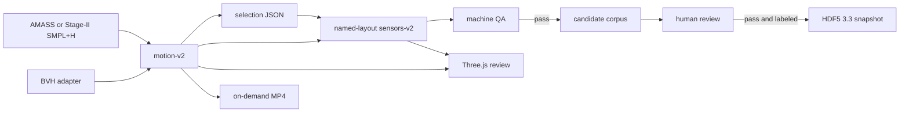

# Architecture

## Artifact responsibilities

| Artifact | Contains |
|---|---|
| motion-v2 | root motion, 52 local rotations, shape, DMPL policy, validity and source clock |
| selection | parent hash, half-open frame range and non-authoritative label candidates |
| sensors-v2 | timestamped six-axis signals, layout, profile and convergence evidence |
| candidate corpus | machine-pass identities and immutable object descriptors |
| review bundle | synchronized skinned body, IMU curves, QA and provenance |
| HDF5 3.3 | samples, labels, provenance and optional replay assets |

Large source archives and licensed body models remain outside the repository.
Outputs are content-bound and never overwritten.

## Virtual IMU

A mount declares a joint, a joint-frame position and the sensor orientation.
The implementation constructs continuous translation and rotation trajectories,
derives specific force and angular velocity on an explicit work grid, filters
them and resamples to the output clock. Convergence compares the selected work
grid with a higher-resolution grid.

## Production

Production jobs process clips independently and keep a SQLite ledger. Motion
and IMU computation can continue while a durable upload queue buffers objects.
A candidate becomes visible only after its content-addressed objects have been
uploaded and verified and its commit record is written last.

The local control API and dashboard operate on the same ledger. They do not
make human review decisions.
